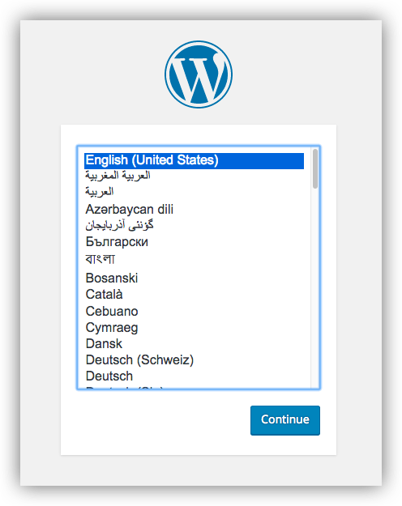

# Intranet wordpress using docker
## First go in the project directory where you will create the project
```
cd project/
```
## Install or download/extract wordpress here
```
curl https://wordpress.org/latest.tar.gz | sudo -u www-data tar zx -C /srv/www
```
## Change the name wordpress to ctaintranet
```
mv wordpress intranet
```
## Change into your project directory
```
cd intranet/
```
## Create a docker-compose.yml file that starts your WordPress blog and a separate MySQL instance with volume mounts for data persistence:
```
version: "3.9"
    
services:
  db:
    image: mysql:5.7
    volumes:
      - db_data:/var/lib/mysql
    restart: always
    environment:
      MYSQL_ROOT_PASSWORD: somewordpress
      MYSQL_DATABASE: wordpress
      MYSQL_USER: wordpress
      MYSQL_PASSWORD: wordpress
    
  wordpress:
    depends_on:
      - db
    image: wordpress:latest
    volumes:
      - wordpress_data:/var/www/html
    ports:
      - "8000:80"
    restart: always
    environment:
      WORDPRESS_DB_HOST: db
      WORDPRESS_DB_USER: wordpress
      WORDPRESS_DB_PASSWORD: wordpress
      WORDPRESS_DB_NAME: wordpress
volumes:
  db_data: {}
  wordpress_data: {}

```
## Build the project 
run ```docker-compose up -d ```from your project directory.
This runs ```docker-compose up ``` in detached mode, pulls the needed Docker images, and starts the wordpress and database containers, as shown in the example below.

```
lungsang@Developer-PC:/mnt/c/project1/ctaintranet$ docker-compose up -d
Creating network "ctaintranet_default" with the default driver
Creating ctaintranet_db_1 ... done
Creating ctaintranet_wordpress_1 ... done
```
## Bring up WordPress in a web browser
 You can use http://localhost as the IP address, and open http://localhost:8000 in a web browser.




# Shutdown and clean up
The command ```docker-compose down``` removes the containers and default network, but preserves your WordPress database.

The command ```docker-compose down --volumes``` removes the containers, default network, and the WordPress database.